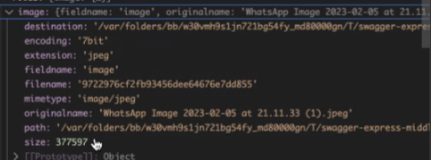

## To run

```bash
npm install
```
```bash
node worker.js
```


## To deploy


## To test


## INPUTS 

Getted by subscription to *jobqueue* channel

job_id
User uuid
Image in blob format


## OUTPUTS

Image with the resulting data

## Job states

- Frontend:
  - ENQUEUED

- Backend:
  - PENDING 
  - RUNNING
  - FINISHED
  - ERROR

Example of a job:

```json
{
    "job_id": "uuid",
    "user_id": "uuid",
    "image": "blob",
    "state": "ENQUEUED",
    "result": "blob"
}
```

## Keyvalues names:
*states*
*logs*

## Object Store names:
*data*
Entradas con nombre job_id+"-input" job_id+"-output"

